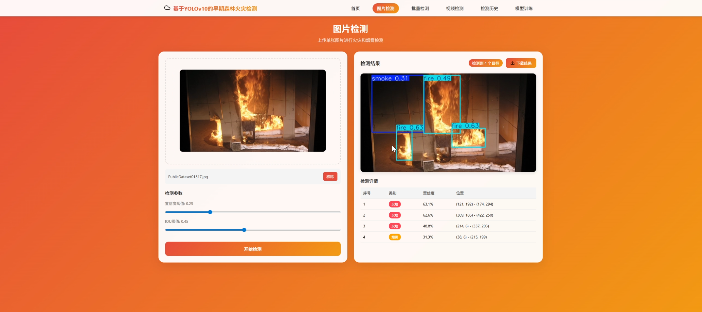
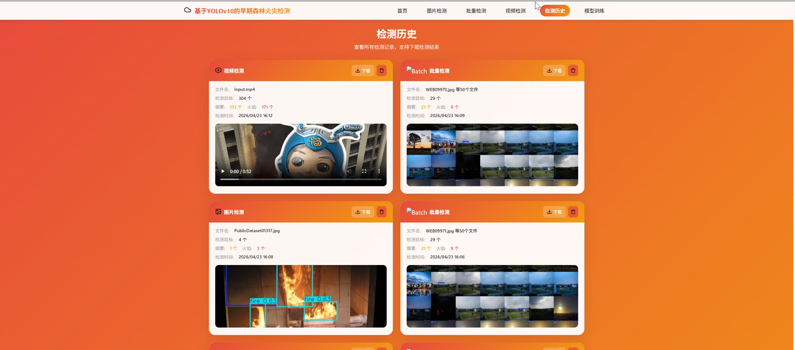

# 基于YOLOv10的早期森林火灾检测系统

[](https://opensource.org/licenses/MIT)


## 项目简介

本项目是一个基于YOLOv10深度学习模型的早期森林火灾检测系统，能够实时检测图像和视频中的火灾和烟雾目标，为森林火灾预警提供技术支持。

### 系统截图

| 图片检测界面 | 检测历史界面 |
| :---: | :---: |
|  |  |

### 主要功能

- **图片检测**：支持单张图片上传，实时识别火灾和烟雾目标
- **批量检测**：支持多张图片批量上传，高效处理大量检测任务
- **视频检测**：支持视频文件上传，逐帧检测火灾隐患
- **模型训练**：支持自定义数据集训练，优化检测精度
- **检测历史**：记录所有检测记录，支持查看和管理

---

## 项目结构

```
yolo_fire_detection/
├── backend/                    # 后端服务
│   ├── app/                    # 应用代码
│   │   ├── __init__.py
│   │   ├── main.py             # FastAPI主入口
│   │   └── database.py         # SQLite数据库操作
│   ├── datasets/               # 数据集配置
│   │   └── data.yaml           # YOLO数据集配置文件
│   ├── models/                 # 模型文件
│   │   └── best.pt             # 预训练模型
│   ├── requirements.txt        # 后端依赖
│   └── run.py                  # 启动脚本
├── frontend/                   # 前端应用
│   ├── src/
│   │   ├── assets/             # 静态资源
│   │   │   └── icons/          # 图标文件
│   │   ├── utils/              # 工具函数
│   │   │   └── api.js          # API接口封装
│   │   ├── views/              # 页面组件
│   │   │   ├── Home.vue        # 首页
│   │   │   ├── ImageDetection.vue   # 图片检测
│   │   │   ├── BatchDetection.vue   # 批量检测
│   │   │   ├── VideoDetection.vue   # 视频检测
│   │   │   ├── History.vue     # 检测历史
│   │   │   └── Training.vue    # 模型训练
│   │   ├── App.vue             # 根组件
│   │   └── main.js             # 入口文件
│   ├── index.html              # HTML模板
│   ├── package.json            # 前端依赖
│   └── vite.config.js          # Vite配置
└── README.md                   # 项目说明文档
```

---

## 环境配置

### 1. 配置Conda国内镜像源（推荐）

由于Anaconda官方源在国外，下载速度较慢，建议配置国内镜像源。

#### 方法一：命令行配置（推荐）

打开 Anaconda Prompt 或终端，执行以下命令：

```bash
# 添加清华镜像源
conda config --add channels https://mirrors.tuna.tsinghua.edu.cn/anaconda/pkgs/main/
conda config --add channels https://mirrors.tuna.tsinghua.edu.cn/anaconda/pkgs/free/
conda config --add channels https://mirrors.tuna.tsinghua.edu.cn/anaconda/cloud/conda-forge/
conda config --add channels https://mirrors.tuna.tsinghua.edu.cn/anaconda/cloud/pytorch/

# 设置搜索时显示通道地址
conda config --set show_channel_urls yes
```

#### 方法二：手动修改配置文件

找到用户目录下的 `.condarc` 文件：
- Windows: `C:\Users\<你的用户名>\.condarc`
- Linux/Mac: `~/.condarc`

用记事本或文本编辑器打开，替换为以下内容：

```yaml
channels:
  - defaults
show_channel_urls: true
default_channels:
  - https://mirrors.tuna.tsinghua.edu.cn/anaconda/pkgs/main
  - https://mirrors.tuna.tsinghua.edu.cn/anaconda/pkgs/r
  - https://mirrors.tuna.tsinghua.edu.cn/anaconda/pkgs/msys2
custom_channels:
  conda-forge: https://mirrors.tuna.tsinghua.edu.cn/anaconda/cloud
  msys2: https://mirrors.tuna.tsinghua.edu.cn/anaconda/cloud
  bioconda: https://mirrors.tuna.tsinghua.edu.cn/anaconda/cloud
  menpo: https://mirrors.tuna.tsinghua.edu.cn/anaconda/cloud
  pytorch: https://mirrors.tuna.tsinghua.edu.cn/anaconda/cloud
  pytorch-lts: https://mirrors.tuna.tsinghua.edu.cn/anaconda/cloud
```

#### 其他可用镜像源

**中科大源：**
```bash
conda config --add channels https://mirrors.ustc.edu.cn/anaconda/pkgs/main/
conda config --add channels https://mirrors.ustc.edu.cn/anaconda/pkgs/free/
conda config --add channels https://mirrors.ustc.edu.cn/anaconda/cloud/conda-forge/
```

**阿里云源：**
```bash
conda config --add channels https://mirrors.aliyun.com/anaconda/pkgs/main/
conda config --add channels https://mirrors.aliyun.com/anaconda/pkgs/free/
conda config --add channels https://mirrors.aliyun.com/anaconda/cloud/conda-forge/
```

#### 验证配置

```bash
# 查看当前配置
conda config --show channels

# 清除索引缓存（建议配置后执行）
conda clean -i
```

#### 恢复默认源（如需）

```bash
conda config --remove-key channels
```

---

### 2. 创建Conda环境

```bash
# 创建环境（Python 3.10 兼容性最佳）
conda create -n fire-detection python=3.10 -y

# 激活环境
# Windows
conda activate fire-detection

# Linux/Mac
source activate fire-detection
```

---

### 3. 安装依赖

#### 后端依赖

```bash
cd backend
pip install -r requirements.txt
```

#### 前端依赖

```bash
cd frontend
npm install
```

---

## 运行项目

### 启动后端服务

```bash
cd backend
python run.py
```

后端服务默认运行在 `http://localhost:8080`

### 启动前端应用

```bash
cd frontend
npm run dev
```

前端应用默认运行在 `http://localhost:5173`

### 访问地址

打开浏览器访问：`http://localhost:5173`

---

## API接口

### 健康检查
```
GET /api/health
```

### 图片检测
```
POST /api/detection/image
Content-Type: multipart/form-data
```

### 批量检测
```
POST /api/detection/batch
Content-Type: multipart/form-data
```

### 视频上传
```
POST /api/detection/video/upload
Content-Type: multipart/form-data
```

### 视频检测
```
POST /api/detection/video/start
Content-Type: multipart/form-data
```

### 训练模型
```
POST /api/training/start
Content-Type: multipart/form-data
```

### 获取检测历史
```
GET /api/detection/history
```

---

## 技术栈

- **前端**：Vue 3 + Vite + Axios
- **后端**：FastAPI + Python 3.10
- **深度学习框架**：Ultralytics YOLOv10
- **数据库**：SQLite
- **图像处理**：OpenCV + NumPy
- **视频处理**：imageio-ffmpeg

---

## 数据集格式

训练数据集需遵循YOLO格式：

```
datasets/
├── train/
│   ├── images/      # 训练图像
│   └── labels/      # 训练标签
├── val/
│   ├── images/      # 验证图像
│   └── labels/      # 验证标签
└── data.yaml        # 数据集配置
```

标签文件格式（每行一个目标）：
```
<class_id> <x_center> <y_center> <width> <height>
```

类别定义：
- 0: smoke（烟雾）
- 1: fire（火焰）

---

## 常见问题

### 1. 下载速度慢
- 确保已配置国内镜像源
- 尝试切换不同的镜像源（清华→中科大→阿里）
- 清除conda索引缓存：`conda clean -i`

### 2. SSL证书错误
```bash
conda config --set ssl_verify false
```

### 3. 模型加载失败
- 确保 `models/best.pt` 文件存在
- 检查模型路径配置是否正确

### 4. FFmpeg 安装失败或视频检测失败

FFmpeg 是视频检测功能必需的依赖，如自动安装失败，可尝试以下方法：

#### 方法一：使用 conda 安装
```bash
# 安装 ffmpeg
conda install -c conda-forge ffmpeg -y

# 安装 imageio-ffmpeg
pip install imageio-ffmpeg>=0.4.0
```

#### 方法二：使用 pip 安装
```bash
# 安装 imageio 和 imageio-ffmpeg
pip install imageio imageio-ffmpeg>=0.4.0
```

#### 方法三：手动下载安装（Windows）
1. 访问 FFmpeg 官方网站：https://ffmpeg.org/download.html
2. 下载 Windows 版本（建议选择 full_build）
3. 解压到 `C:\ffmpeg`
4. 将 `C:\ffmpeg\bin` 添加到系统环境变量 PATH 中
5. 重启终端，验证安装：
   ```bash
   ffmpeg --version
   ```

#### 方法四：手动下载安装（Linux）
```bash
# Ubuntu/Debian
sudo apt update && sudo apt install ffmpeg -y

# CentOS/RHEL
sudo yum install ffmpeg -y

# 验证安装
ffmpeg --version
```

#### 方法五：手动下载安装（Mac）
```bash
# 使用 Homebrew
brew install ffmpeg

# 验证安装
ffmpeg --version
```

#### 验证安装
```bash
# 检查 ffmpeg 是否可用
ffmpeg --version

# 检查 Python 能否导入
python -c "import imageio_ffmpeg; print(imageio_ffmpeg.get_ffmpeg_exe())"
```

---

## License

MIT License

---

## 联系方式

如有问题或建议，请提交Issue或联系开发者。